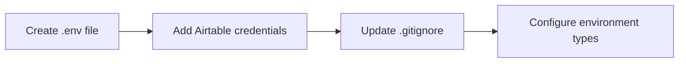
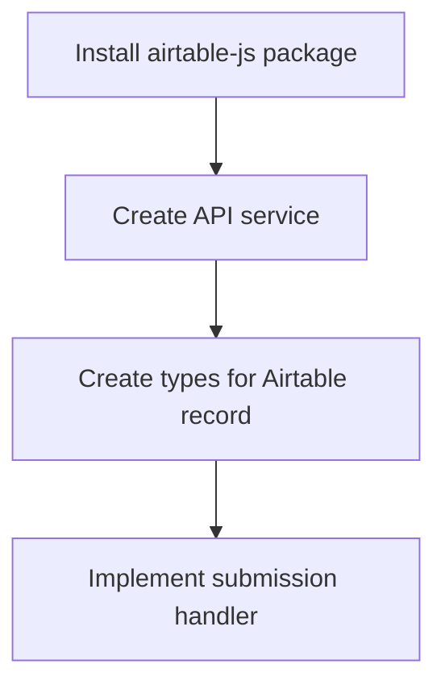
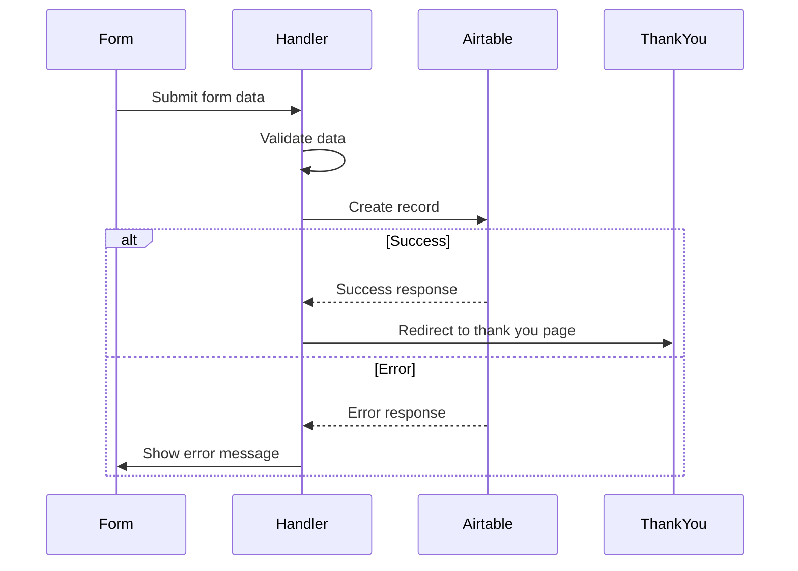

# Airtable Waitlist Integration Plan

## Overview
Connect the waitlist form to Airtable to store user submissions securely and efficiently.

## Environment Setup



### Environment Variables
Create `.env` file with the following variables:
```
VITE_AIRTABLE_API_KEY=pat26IM6aUY7w56VS.cd23c7f358b5d1373f0303ccb2aede54681b95d4124daa2344baa4cbdaacf1f1
VITE_AIRTABLE_BASE_ID=appyAgeyAmkC0h7FS
VITE_AIRTABLE_TABLE_ID=viwZBrilHWCD4yjgz
```

## Dependencies and API Integration



### Required Dependencies
- @airtable/blocks: For TypeScript support and API integration
- react-hot-toast: For user notifications

## Form Submission Flow



## Implementation Steps

1. **Environment Configuration**
   - Create `.env` file with Airtable credentials
   - Update `.gitignore` to include `.env`
   - Add environment variable types in `src/types/env.d.ts`

2. **Install Dependencies**
   ```bash
   npm install @airtable/blocks react-hot-toast
   ```

3. **Create Airtable Service**
   - Create `src/services/airtable.ts`
   - Implement connection configuration
   - Create interface for waitlist record:
     ```typescript
     interface WaitlistRecord {
       Name: string;
       Email: string;
       Company: string;
       Message?: string;
       Status: 'Joined Waitlist';
     }
     ```

4. **Update Form Handler**
   - Modify `handleSubmit` function in WaitlistPage
   - Add loading state
   - Implement error handling
   - Add success/error notifications
   - Update navigation logic

5. **Error Handling & User Experience**
   - Add form submission loading state
   - Implement error messages
   - Add input validation
   - Handle network errors
   - Show success/error notifications

6. **Testing & Validation**
   - Test form submission
   - Verify error handling
   - Check Airtable record creation
   - Validate field mapping

## Security Considerations
- Store API key securely in environment variables
- Implement rate limiting
- Validate input data
- Handle errors gracefully
- Never expose API key in client-side code

## Next Steps
1. Switch to code mode for implementation
2. Create necessary files and configurations
3. Implement the integration
4. Test the functionality
5. Deploy the changes